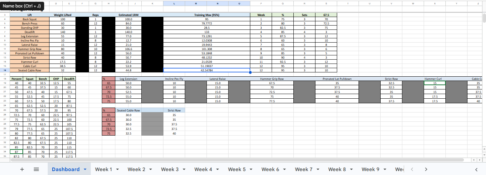

# 💪 Strength Training Logbook

A 12-week Excel-based strength training logbook designed for athletes who combine boxing and resistance training.

This workbook automatically calculates your Estimated 1RM, Training Max (95%), and weekly training weights using percentage-based programming.

---

## Features

- Automatic Estimated 1RM (Epley Formula)
- Automatic 95% Training Max
- 12-week progressive overload
- Automatic workout calculations
- Dashboard linked to every training week
- Automatic rounding to the nearest 2.5 kg
- Deload weeks included

---

## 12-Week Progression

This logbook follows a 12-week percentage-based progression using a **95% Training Max**. Compound lifts use higher intensities to develop maximal strength, while accessory lifts use moderate percentages to build muscle and reinforce movement patterns.

| Week | Compound Lifts | Accessory Lifts | Focus |
|------|---------------:|----------------:|--------|
| 1 | 75% | 65% | Base Volume |
| 2 | 79% | 67.5% | Progressive Overload |
| 3 | 82% | 70% | Strength Development |
| 4 | 85% | 72.5% | Peak Training |
| 5 | 70% | 65% | Deload |
| 6 | 75% | 70% | Rebuild |
| 7 | 77.5% | 67.5% | Progressive Overload |
| 8 | 80% | 70% | Strength Development |
| 9 | 82.5% | 72.5% | High Intensity |
| 10 | 87% | 75% | Peak Strength |
| 11 | 70% | 65% | Deload |
| 12 | 75% | 70% | Final Consolidation |

### Compound Lifts

- Back Squat
- Bench Press
- Standing Overhead Press
- Deadlift

### Accessory Lifts

**Push Day**
- Leg Extension
- Incline Pec Fly
- Lateral Raise

**Pull Day**
- Hammer Grip Row
- Pronated Lat Pulldown
- Seated Cable Row
- Strict Row
- Hammer Curl
- Cable Curl

---

---

## Screenshots

### Dashboard



---

### Week 1 - Push


---

### Week 1 - Pull


---

### Week 12 - Push


---

### Week 12 - Pull


---

### 1RM Calculator


---

### Progression Table


---

## Weekly Training Schedule

| Day | Training |
|------|----------|
| Monday | Boxing |
| Tuesday | Strength (Push) |
| Wednesday | Boxing |
| Thursday | Strength (Pull) |
| Friday | Boxing |

---

## Tuesday – Push

- Back Squat
- Bench Press
- Standing Overhead Press
- Leg Extension
- Incline Pec Fly
- Lateral Raise

---

## Thursday – Pull

- Deadlift
- Hammer Grip Row
- Pronated Lat Pulldown
- Seated Cable Row
- Strict Row
- Hammer Curl
- Cable Curl

---

## Formula

### Estimated 1RM

```text
1RM = Weight × (1 + Reps / 30)
```

### Training Max

```text
Training Max = Estimated 1RM × 0.95
```

---

Developed by **Aaron Lewis**
