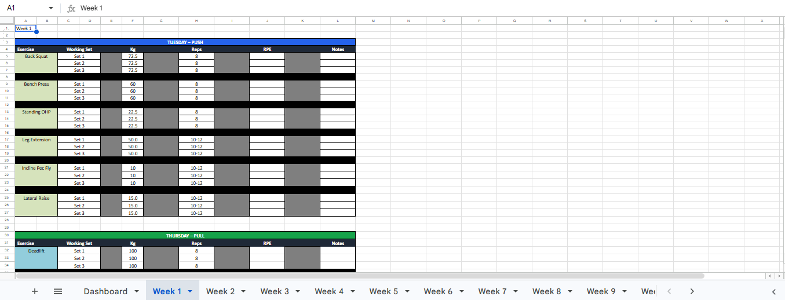
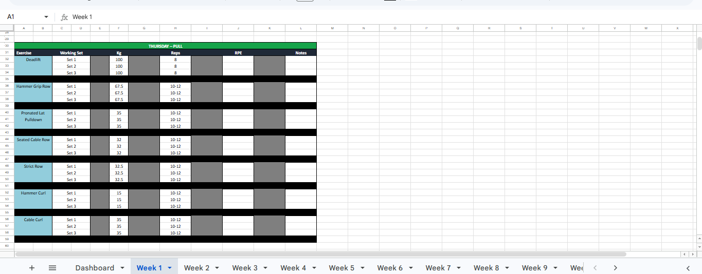
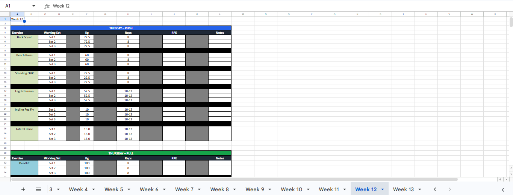
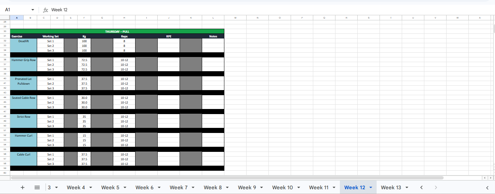
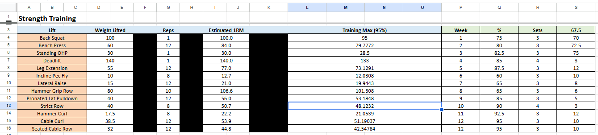
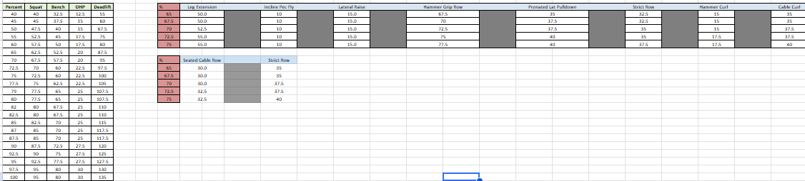

# 💪 Strength Training Logbook

A 12-week Excel-based strength training logbook designed for athletes who combine boxing and resistance training.

This workbook automatically calculates your Estimated 1RM, Training Max (95%), and weekly training weights using percentage-based programming.

---

## Features

- Automatic Estimated 1RM (Epley Formula)
- Automatic 95% Training Max
- 12-week progressive overload
- Automatic workout calculations
- Dashboard linked to every training week
- Automatic rounding to the nearest 2.5 kg
- Deload weeks included

---

## Weekly Training Schedule

| Day | Training |
|-----|----------|
| Monday | Boxing |
| Tuesday | Strength (Push) |
| Wednesday | Boxing |
| Thursday | Strength (Pull) |
| Friday | Boxing |

---

## Tuesday – Push

- Back Squat
- Bench Press
- Standing Overhead Press
- Leg Extension
- Incline Pec Fly
- Lateral Raise

---

## Thursday – Pull

- Deadlift
- Hammer Grip Row
- Pronated Lat Pulldown
- Seated Cable Row
- Strict Row
- Hammer Curl
- Cable Curl

---

## Formula

Estimated 1RM

```
1RM = Weight × (1 + Reps / 30)
```

Training Max

```
Training Max = Estimated 1RM × 0.95
```

---

Developed by Aaron Lewis


---

# Screenshots

## Dashboard


---

## Week 1 - Push



---

## Week 1 - Pull



---

## Week 12 - Push



---

## Week 12 - Pull



---

## 1RM Calculator



---

## Progression Table


